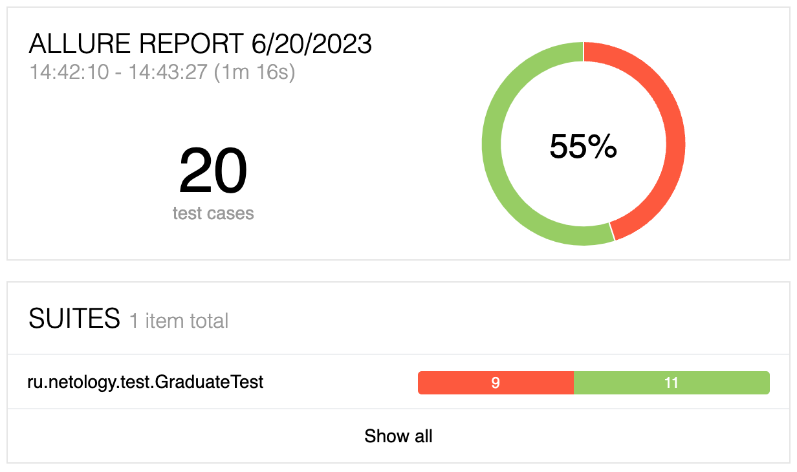
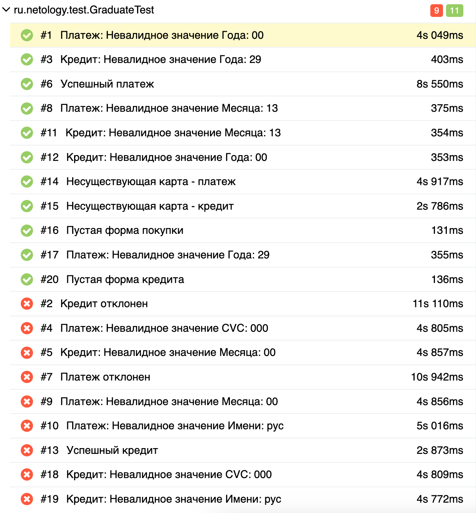

### Отчет о проведенном тестировании

Проведено автоматизированное тестирование приложения для покупки тура в соответствии с поставленной [задачей](https://github.com/netology-code/qa-diploma). 
Тестирование включает в себя 20 тест-кейсов, из которых 55% тест-кейсов прошли успешно: 

**Рекомендации:**

1. Исправить все обнаруженные баги, описание которых находится в [Issues](https://github.com/olga-belikova/Graduate/issues).
2. Исправить название тура "Марракэш" на принятое "Марракеш".
3. Исправить отображение кнопок "Купить" и "Купить в кредит": При загрузке приложения обе кнопки должны быть одного цвета - неактивные. При нажатии на одну из кнопок - она должна менять цвет, становясь активной.
4. При открытии формы (и покупки, и кредита) кнопка "Продолжить" внизу формы должна быть неактивной. Кнопка должна становиться активной только после того, как все поля формы будут заполнены корректными значениями.
5. Выводить сообщение о некорректно заполненном поле формы сразу после заполнения поля, а не после нажатия на кнопку "Продолжить".